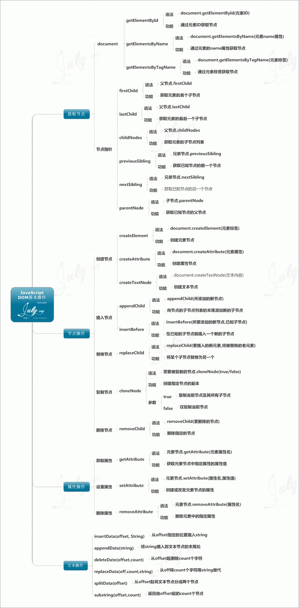

**DOM**

文档对象模型（Document Object Model）：网页被加载时，由浏览器创建。定义了访问处理HTML文档的标准对象和标准方法    
HTML DOM TREE    
 
 
 javascript DOM :    
 

- - - 

* innerHTML - 修改HTML的内容 document.getElementById(id).innerHTML = new HTML ; 
* document.getElementById(id).style.property = new style; 改变CSS样式

HTML DOM EventListener:
* element.addEventListener(event,function,useCapture);
* 第一个参数是事件的类型 (如 "click" 或 "mousedown").
* 第二个参数是事件触发后调用的函数。
* 第三个参数是个布尔值用于描述事件是冒泡还是捕获。该参数是可选的。

事件传递有两种方式：冒泡与捕获。    
>事件传递定义了元素事件触发的顺序。 如果你将 &ltp&rt 元素插入到 
 元素中，用户点击 
 元素, 哪个元素的 "click" 事件先被触发呢？    
>在冒泡中，内部元素的事件会先被触发，然后再触发外部元素，即： 
 元素的点击事件先触发，然后会触发 
 元素的点击事件。        
>在捕获中，外部元素的事件会先被触发，然后才会触发内部元素的事件，即： 
 元素的点击事件先触发 ，然后再触发 
 元素的点击事件。        
>addEventListener() 方法可以指定 "useCapture" 参数来设置传递类型：    
>addEventListener(event, function, useCapture);    
>默认值为 false, 即冒泡传递，当值为 true 时, 事件使用捕获传递。
